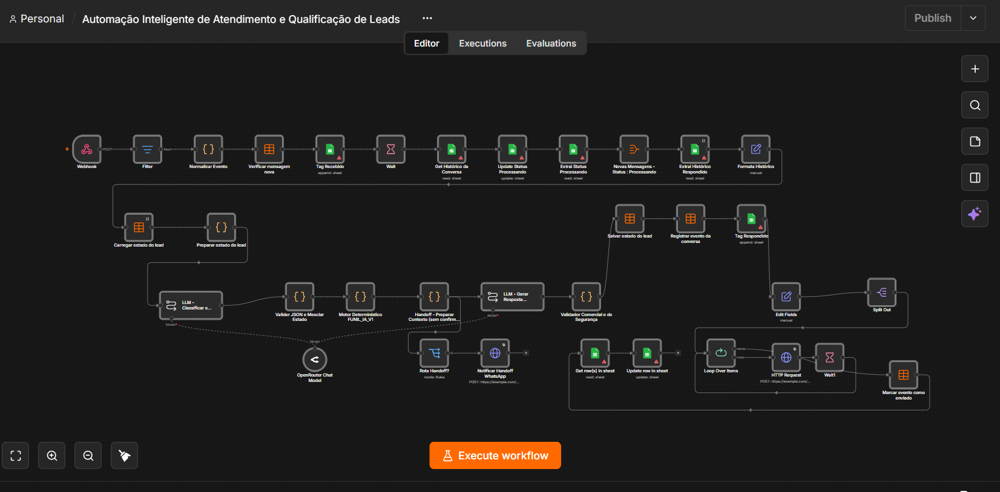

# Automação Inteligente de Atendimento e Qualificação de Leads

Projeto prático implementado e personalizado por **Matheus Modesto**, com melhorias no gerenciamento de estado, segurança das respostas e transferência para atendimento humano (handoff).

## Visão geral

A automação recebe mensagens por webhook, organiza o histórico da conversa, identifica a intenção do lead com apoio de um modelo de linguagem e aplica regras determinísticas antes de gerar a resposta. Quando necessário, encaminha o contato para atendimento humano com o contexto já estruturado.

## Visão do fluxo

## Principais recursos

- Recebimento e normalização de eventos via webhook;
- filtro de mensagens e prevenção de processamento duplicado;
- histórico e estado persistente da conversa;
- classificação de intenção e extração de dados em JSON;
- motor determinístico para controle do funil;
- geração de respostas controladas por LLM;
- validação comercial e de segurança;
- handoff para atendimento humano;
- registro de eventos e controle de mensagens enviadas.

## Tecnologias utilizadas

- n8n;
- LLM via OpenRouter;
- Google Sheets;
- n8n Data Tables;
- webhooks e requisições HTTP;
- integração com canal de atendimento por API.

## Estrutura do fluxo

1. Recebe e valida a mensagem.
2. Recupera o histórico e o estado do lead.
3. Classifica a intenção e extrai informações estruturadas.
4. Aplica regras do funil e prepara o contexto.
5. Gera e valida a resposta.
6. Salva o novo estado e registra os eventos.
7. Envia a resposta ou aciona o handoff humano.

## Arquivo da automação

O arquivo importável está em:

`workflow/automacao-atendimento-qualificacao.json`

## Como utilizar

1. Importe o JSON no n8n.
2. Configure as credenciais do Google Sheets e do provedor de LLM.
3. Substitua os campos `CONFIGURE_*` pelos identificadores e endpoints do seu ambiente.
4. Revise os prompts, regras comerciais e integrações antes de ativar a workflow.

## Segurança

Esta versão foi preparada exclusivamente para portfólio. Credenciais, identificadores, URLs privadas, contatos e referências comerciais foram removidos ou substituídos por exemplos. A workflow é distribuída desativada e não deve ser executada sem configuração prévia.

## Autoria

Projeto prático implementado e personalizado por Matheus Modesto. A documentação descreve as adaptações e melhorias aplicadas ao fluxo para demonstrar conhecimentos em automação, agentes de IA, integrações, estado conversacional e segurança.
